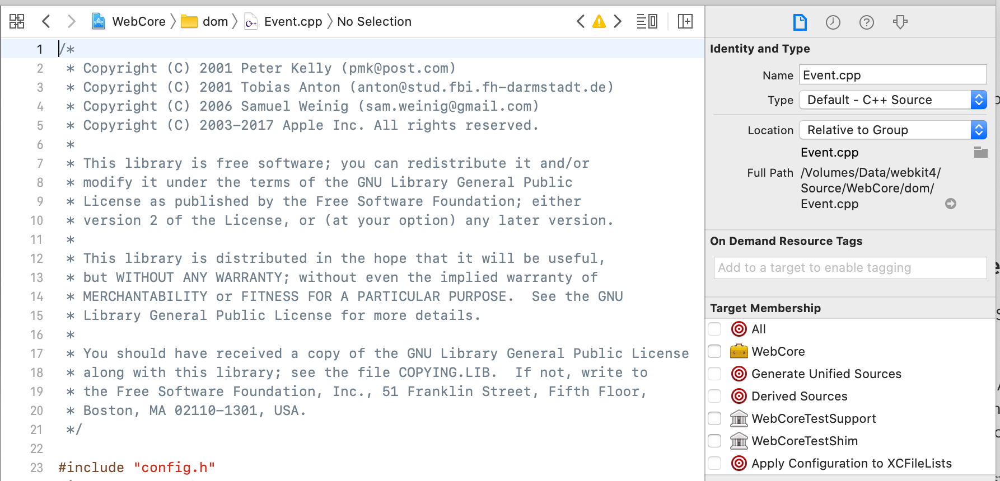
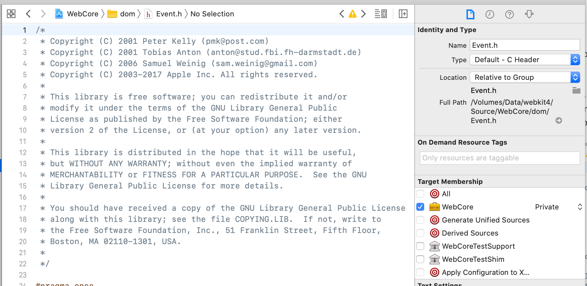

# Adding a New File

How to add a new file to WebKit

## Overview

To add a new header file or a translation unit (e.g. `.cpp`, `.m`, or `.mm`),
open WebKit.xcworkspace and add respective files in each directory.

Make sure to uncheck the target membership so that it’s not compiled as a part of the framework in xcodebuild.
Instead, add the same file in Sources.txt file that exists in each subdirectory of Source.
e.g. [Source/WebCore/Sources.txt](https://github.com/WebKit/WebKit/blob/main/Source/WebCore/Sources.txt) for WebCore.
This will ensure the newly added file is compiled as a part of *unified sources*.

When a header file in WTF is used in WebCore, or a header file in WebCore is used in WebKit or WebKitLegacy,
we need to export the file to those projects.
To do that, turn on the target membership in respective framework as set the membership to “Private” as seen below.
This will ensure the relevant header file is exported from WTF / WebCore to other downstream projects like WebKitLegacy.

Non-cocoa ports, like WPE and GTK, use CMake for building the project. If the header is not platform-specific, you might 
want to add an entry for it into the relevant Headers.cmake. For example, if a WebCore header is included by WebKit, you 
will need to list the header in Source/WebCore/Headers.cmake.

FIXME: Mention WTF_EXPORT_PRIVATE and WEBCORE_EXPORT.
