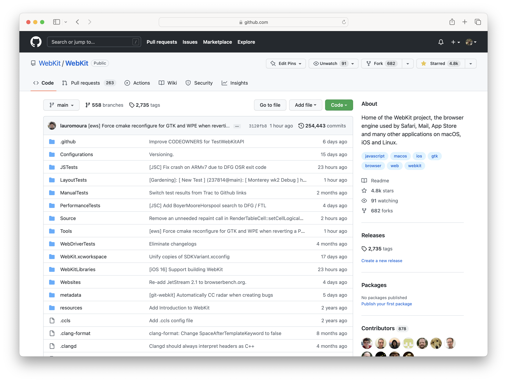

# GitHub

## Overview

WebKit officially switched over to using GitHub for managing source code in June of 2022. The announcement can be found on the WebKit blog [here](https://webkit.org/blog/13140/webkit-on-github/).

WebKit uses a pretty standard git workflow with some custom additions on top.
